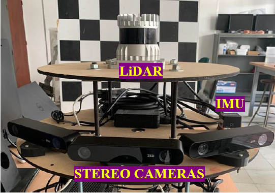
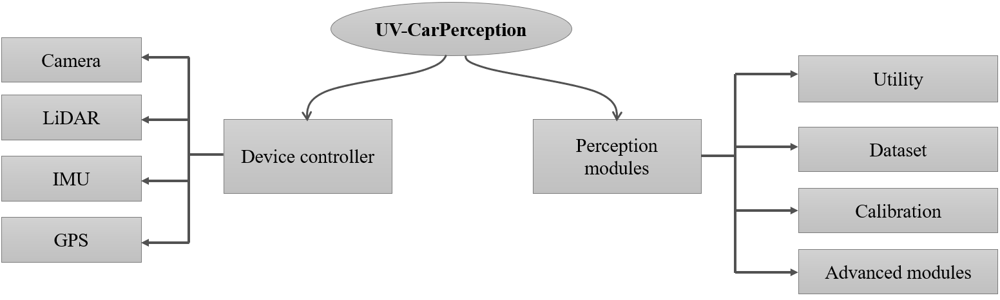

# UV-CarPerception
The UV-CarPerception tool is developed as part of the objectives of the doctoral thesis entitled Time-Varying Semantic Maps for Long-term Localization using Multi-Modal Perception Systems, belonging to the    Perception and Intelligent Systems (PSI) research group at Universidad del Valle.
The application is designed to perform perception and mapping tasks in urban environments using a multi-sensor platform composed of three ZED2 stereo cameras, a 3D Ouster OS0 LiDAR scanner or Velodyne sensor, an inertial measurement unit (IMU), and a GPS receiver, all integrated on an embedded Jetson ORIN AGX system. Its main objective is to process the visual and geometric information resulting from the fusion of camera and LiDAR data to identify and register characteristic objects of the urban environment, while the IMU and GPS data provide odometry information for localization tasks.



This module will install the perception modules into the ROS2 workspace from individual bash files

## 📦 Pre-Requisites
- It is mandatory to install ros2 framework with its dependencies and libraries.
  Please check the github repo:  
  https://github.com/alvaroNavarro/ros2_installer-origin

- Ensure to have installled the drivers for the camera (SDK ZED)
  Please check the main URL:  
  https://www.stereolabs.com/docs/ros2

- Ensure to have installed the drivers for the Ouster LiDAR or velodyne sensor.
  Please check the github repo:   
  https://github.com/ouster-lidar/ouster-ros   
  https://github.com/ros-drivers/velodyne

- Ensure to have installed the drivers for the XSense IMU.
  Please check the github repo:   
  https://github.com/DEMCON/ros2_xsens_mti_driver

Please contact to alvaro.navarro@correounivalle.edu.co   

- Add the package gps_imu that is found in the following repository:   
  https://github.com/alvaroNavarro/gps_imu

## 📦 Features

The application is divided into two sections as depicted in Fig 1. The first section comprises the sensor packages mentioned before and the right section comprises all packages of perception module.



The section of UV-CarPerception modules are composed by the following subsections:

1. **Utility**: The packages that validate the operation of the sensor devices are defined, as well as the visualization and synchronization package
2. **Dataset**: This contains the dataset creation packages, which store in a repository the information related to the images from each camera, point clouds, and odometry data for each trajectory or sequence.
3. **Calibration**: This contains the individual calibration packages for the cameras, allowing the extraction of their intrinsic parameters, as well as the calibration between the laser and each camera to extract the extrinsic parameters (the transformation matrix that defines the position and orientation of each camera’s reference frame with respect to the laser sensor reference frame).
4. **Advanced**: Este contiene los paquetes de creación de la imágen pannorámica, proyección de nubes de puntos sobre el mosaico parnoármico y el registro de la nube de puntos sobre los recorridos establecidos.

Please check each bash file to know the name of each ROS package.

## 🚀 Getting Started
 
### 1. Clone the repository
 
```
git clone https://github.com/alvaroNavarro/UV-CarPercept.git
cd UV-CarPercept
```

### 2. Run the UV-CarPercept installation script
```
sudo chmod +x installation.sh
./installation.sh
```

All the packages are installed and sourced in the workspace!

## 🚀 Usage
1. **Utility**: Please refer to the repository:   
   https://github.com/alvaroNavarro/multi_sensor for testing each sensor device  
   https://github.com/alvaroNavarro/test_sync_camera_lidar for synchronizing camera and LiDAR and visualize the data in RVIZ

2. **Dataset**: Please refer to the repository:    
   https://github.com/alvaroNavarro/create_UV_dataset for creating the dataset from sensor information.   
   https://github.com/alvaroNavarro/open_dataset for openning the dataset for applying specific perception tasks.

3. **Calibration**: Please refer to the repository:   
   https://github.com/alvaroNavarro/zed_calibration for ZED camera calibration   
   https://github.com/alvaroNavarro/cam_lidar_calibration for calibration camera - LiDAR

4. **Advanced**: Please refer to the repository:   
   https://github.com/alvaroNavarro/panoramic_image for creating panoramic images.
   https://github.com/alvaroNavarro/projection_lidar_cameras for projecting point cloud onto the individual and mosaic images.
   https://github.com/alvaroNavarro/kiss_icp_wrapper for registering point cloud associated to different sequences

   Contact:   
   Alvaro Navarro-Perez email: alvaro.navarro@correounivalle.edu.co
